## 📃 Инструкция по установке

### 1. Скрипт tg2obsidian

#### 1.1. Скачивание скрипта
1. Перейти по ссылке https://github.com/dimonier/tg2obsidian
2. Нажать на зелёную кнопку `Code` и в выпавшем меню выбрать `Download ZIP`
	
3. Дождаться окончания загрузки архива `tg2obsidian-main.zip`
4. Распаковать его в любую папку.
   Это отдельная программа, её не нужно хранить внутри vault.

### 2. Установка Python
1. Установить с официального сайта [Python 3.10+](https://www.python.org/downloads/)
	❗если планируете использовать функцию распознавания аудиосообщений, то нужно устанавливать версию 3.10, а не 3.11
1. Поставить галочку `Add python.exe to PATH` во время установки
	,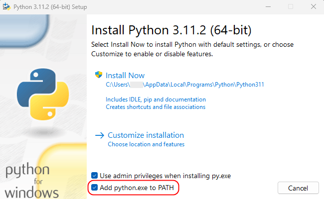

#### 2.2. Проверить, запускается ли Python из любой папки
1. Запустить командную строку (`Пуск -> Командная строка`)
2. Ввести команду `python`

Позитивный исход:
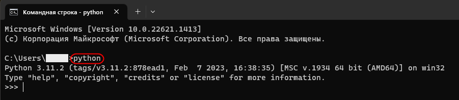

Негативный исход:
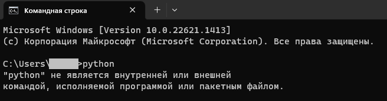
говорит о том, что не установлены переменные окружения → выполняем пункт `2.3. Установка переменной окружения Path`

#### 2.3. Установка переменной окружения Path
1. Получить адрес папки, куда установился Python.
	По умолчанию это путь `C:\Users\<user_name>\AppData\Local\Programs\Python\Python311`

2. Открыть окно "**Переменные среды**"
	в Windows 11 эти параметры находятся `Пуск → Параметры → Система → О системе → Дополнительные параметры системы`
	.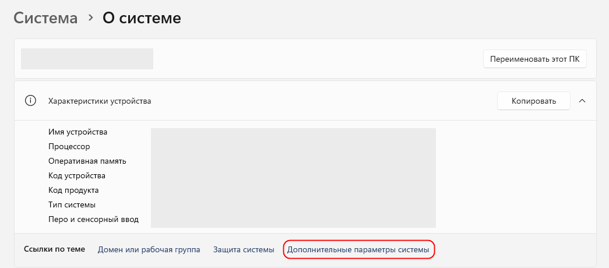
	В открывшемся окне нажать кнопку `Переменные среды...`
	.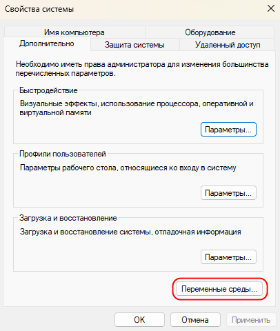

3. Добавить к системной переменной `Path` адрес папки с установленным Python:
	Выделить системную переменную `Path` и нажать кнопку `Изменить`:
		,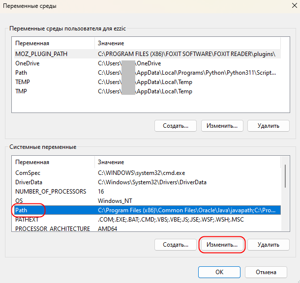
	Создать новое значение, указав путь до папки с установленным Python:
		.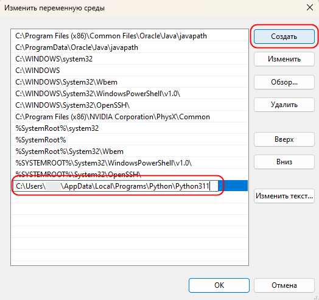

4. Проверить, что Python доступен из любой папки, используя пункт `2.2. Проверить, запускается ли Python из любой папки`
	Если командная строка была запущена, то её нужно закрыть и запустить снова.

### 3. Установите требуемые зависимости
1. Запустить командную строку (`Пуск -> Командная строка`)
2. Последовательно ввести следующие команды, дожидаясь окончания процесса:
```
pip install aiogram
pip install beautifulsoup4
pip install lxml
```

### 4. Установите модуль Whisper
Если требуется распознавать голосовые сообщения, установите модуль [Whisper](https://github.com/openai/whisper) (также через командную строку):
```
pip install -U openai-whisper
```

### 5. Установите скомпилированный FFMPEG
1. Перейдите по ссылке https://www.gyan.dev/ffmpeg/builds/, прокрутите страницу вниз до раздела `release builds`  и из подраздела `latest release` скачайте
	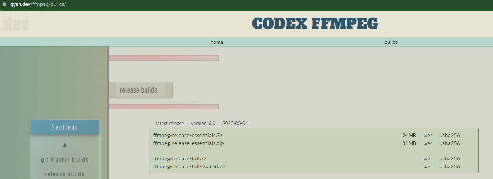
	версию от *gyan.dev* с https://www.gyan.dev/ffmpeg/builds/ файл `ffmpeg-release-full.7z`
3. Распакуйте архив **FFMPEG**
   Можно в папку со скриптом `tg2obsidian`.
4. Добавьте путь к исполняемому файлу (в Windows - `ffmpeg.exe`) в переменную окружения path.
	Где найти эту переменную окружения - см. [2.3. Установка переменной окружения Path](#2.3.%20Установка%20переменной%20окружения%20Path)
   ❗Теперь важно не перемещать файл `ffmpeg.exe`
4. Запустите командную строку `cmd` и введите
```
ffmpeg
```
Если появится много текста (справка по ffmpeg), значит - всё в порядке.
А если `command not recognized` - значит файл не нашёлся, и нужно проверить правильность установки переменной окружения path.

### 5.  Создайте своего бота Telegram
при помощи [https://t.me/BotFather](https://t.me/BotFather)

1. Перейдите по ссылке  [https://t.me/BotFather](https://t.me/BotFather) и откройте бота в Telegram
2. Нажмите кнопку "Запустить"
3. Напишите в чате `/newbot`, чтобы создать нового бота
4. Введите имя для бота
5. Введите имя бота, оно должно заканчиваться на `bot` (оно же будет название вашего Telegram-канала)
6. Скопируйте token
7. Перейдите по ссылке в своей Telegram-bot

### 6. Настройка файла конфигурации
#### 6.1. Настройка связи плагина с ботом
1. В папке плагина `tg2obsidian-main` откройте файл `config.py` любым текстовым редактором
2. Вводим токен, выданный ботом в верхнюю строку
	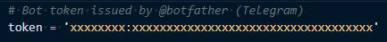
3. В параметр `inbox_path` вводим путь до папки, куда будут сохраняться записи из бота
   ❗в конце адресной строки не должно быть `\`
	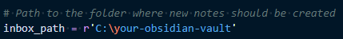
	например,
	```
	inbox_path = r'C:\OBSIDIAN\00. Telegram INBOX'
	```
4. В параметр `photo_path` вводим путь до папки, куда будут сохраняться вложения
   ❗в конце строки с адресом не должно быть `\`
	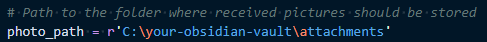
	например,
	```
	photo_path = r'C:\OBSIDIAN\00. Telegram INBOX\_attachments'
	```

#### 6.2. Включение распознавания аудиосообщений
1. В папке плагина `tg2obsidian-main` откройте файл `config.py` любым текстовым редактором
2. Установите параметр `recognize_voice`  в значение `True`, т.е.
	```
	recognize_voice = True
	```

### 7. (опционально) Создайте группу с ботом
1. Создайте частную группу в Telegram
2. Перейдите в личную переписку с ботом в Telegram
3. Нажмите на кнопку с 3мя точками, затем выберите `Показать профиль`
	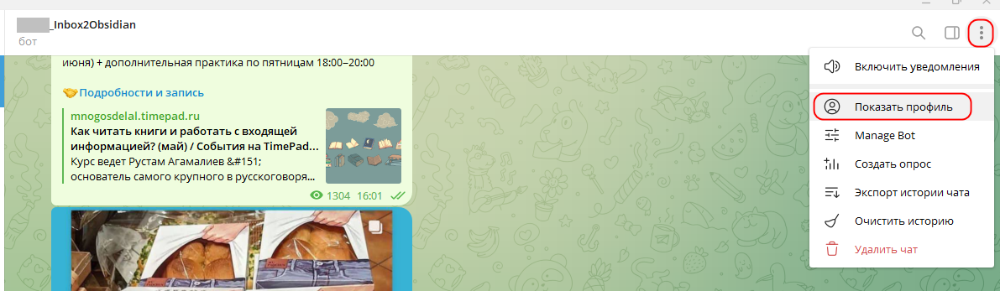
4. В окне нажмите кнопку `Добавить в группу` и укажите группу
5. Откройте в указанной группе настройки (`Управление группой`)
	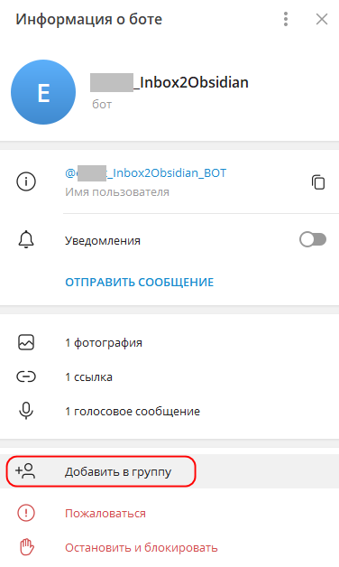
6. Выберите пункт `Администраторы` и добавьте бота, чтобы он мог читать сообщения
	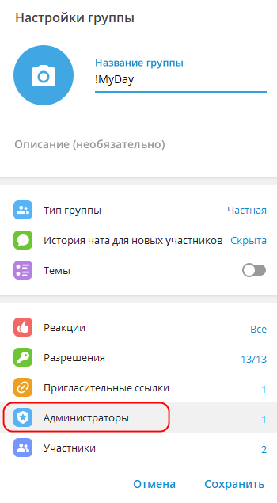

## 📃 Инструкция по использованию
1.  Отправляйте/пересылайте сообщения, которые должны попасть в ваше хранилище Obsidian, в свою приватную группу Telegram или напрямую вашему боту.
2. Чтобы запустить бота для загрузки сообщений от бота в Obsidian, запустите файл `tg2obsidian_bot.bat` из папки скрипта
	-   На постоянно работающем компьютере или на сервере Бота можно не выключать. Тогда он будет распознавать речь и заносить заметки в Obsidian в реальном времени.
	-   Если вы включаете компьютер только на время использования, запускайте Бота непосредственно тогда, когда нужно получить сообщения в Obsidian, а после получения всех сообщений закрывайте скрипт.
	- Скрипт не требует запущенный Telegram и Obsidian на компьютере

**Важно!** Бот может получить сообщения только за последние 24 часа. Если от момента отправки сообщения до запуска Бота прошло более 24 часов, такое сообщение уже не будет получено Ботом.

### Распознавание аудиосообщений
Особенности:
- Распознаваться будут только файлы размером меньше 20Мб
- Перед распознаванием скрипт скачивает файл на компьютер,
  Распознавание происходит на компьютере, если запущен файл `tg2obsidian_bot.bat`

Во время распознавания в cmd-интерфейсе бота отображается процесс распознавания файла.
	В квадратных скобах указывается время: `сколько прошло времени` < `сколько времени осталось работать`
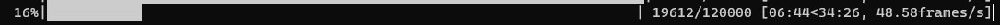

## Наслаждайтесь!
